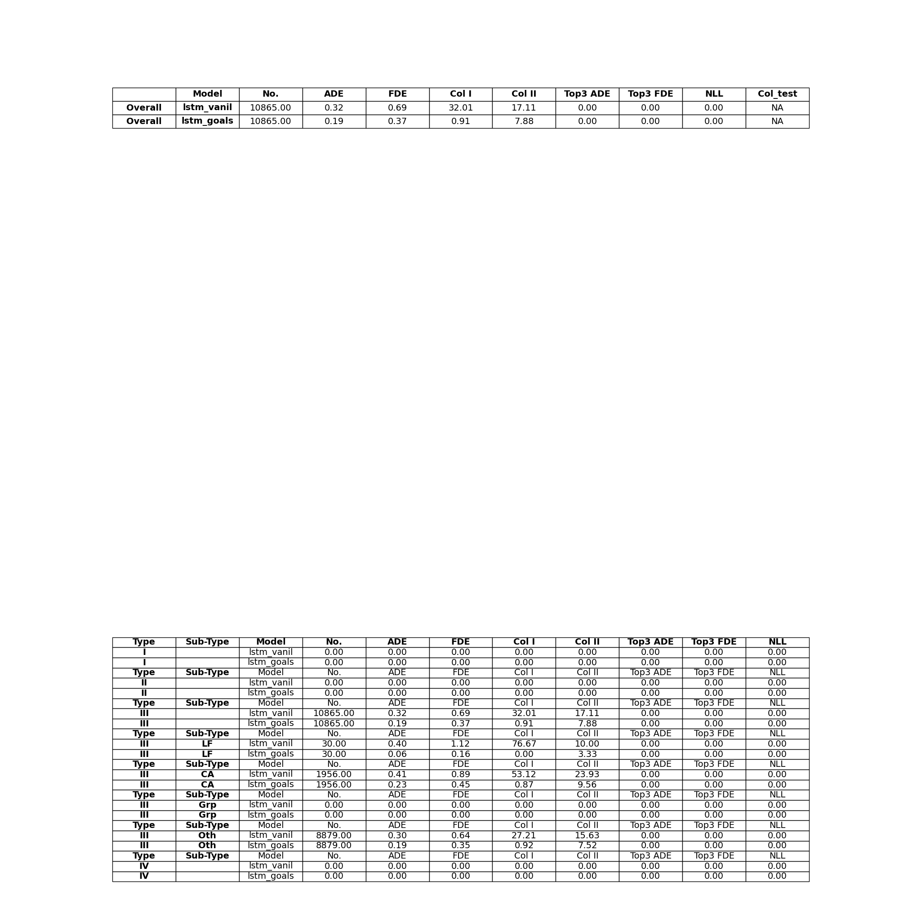
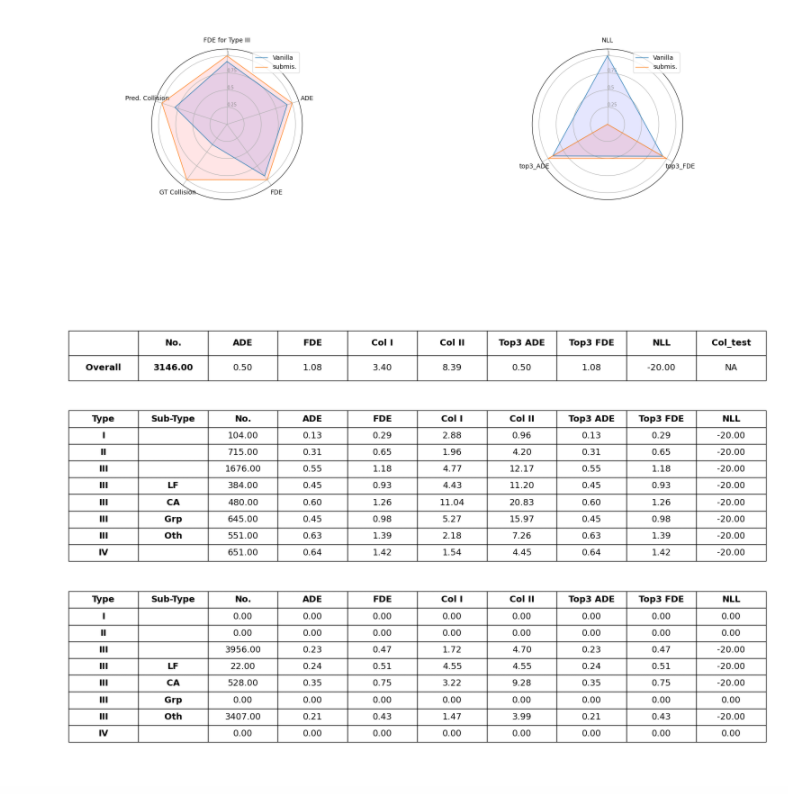

TrajNet++ : The Trajectory Forecasting Framework
================================================

PyTorch implementation of `Human Trajectory Forecasting in Crowds: A Deep Learning Perspective <https://arxiv.org/pdf/2007.03639.pdf>`_ 

.. figure:: docs/train/cover.png

TrajNet++ is a large scale interaction-centric trajectory forecasting benchmark comprising explicit agent-agent scenarios. Our framework provides proper indexing of trajectories by defining a hierarchy of trajectory categorization. In addition, we provide an extensive evaluation system to test the gathered methods for a fair comparison. In our evaluation, we go beyond the standard distance-based metrics and introduce novel metrics that measure the capability of a model to emulate pedestrian behavior in crowds. Finally, we provide code implementations of > 10 popular human trajectory forecasting baselines.

Data Setup
==========

The detailed step-by-step procedure for setting up the TrajNet++ framework can be found `here <https://thedebugger811.github.io/posts/2020/03/intro_trajnetpp/>`_

Converting External Datasets
----------------------------

To convert external datasets into the TrajNet++ framework, refer to this `guide <https://thedebugger811.github.io/posts/2020/10/data_conversion/>`_ 

Training Models
===============

LSTM
----

The training script and its help menu:
``python -m trajnetbaselines.lstm.trainer --help``

**Run Example**

.. code-block::

   ## Our Proposed D-LSTM
   python -m trajnetbaselines.lstm.trainer --type directional --augment

   ## Social LSTM 
   python -m trajnetbaselines.lstm.trainer --type social --augment --n 16 --embedding_arch two_layer --layer_dims 1024

GAN
---

The training script and its help menu:
``python -m trajnetbaselines.sgan.trainer --help``

**Run Example**

.. code-block::

   ## Social GAN (L2 Loss + Adversarial Loss)
   python -m trajnetbaselines.sgan.trainer --type directional --augment
   
   ## Social GAN (Variety Loss only)
   python -m trajnetbaselines.sgan.trainer --type directional --augment --d_steps 0 --k 3

Evaluation
==========

The evaluation script and its help menu: ``python -m evaluator.trajnet_evaluator --help``

**Run Example**

.. code-block::

   ## TrajNet++ evaluator (saves model predictions. Useful for submission to TrajNet++ benchmark)
   python -m evaluator.trajnet_evaluator --output OUTPUT_BLOCK/trajdata/lstm_directional_None.pkl --path <path_to_test_file>
   
   ## Fast Evaluator (does not save model predictions)
   python -m evaluator.fast_evaluator --output OUTPUT_BLOCK/trajdata/lstm_directional_None.pkl --path <path_to_test_file>

More details regarding TrajNet++ evaluator are provided `here <https://github.com/vita-epfl/trajnetplusplusbaselines/blob/master/evaluator/README.rst>`_

Evaluation on datasplits is based on the following `categorization <https://github.com/vita-epfl/trajnetplusplusbaselines/blob/master/docs/train/Categorize.png>`_

Results
-------

Unimodal Comparison of interaction encoder designs on interacting trajectories of TrajNet++ real world dataset. Errors reported are ADE / FDE in meters, collisions in mean % (std. dev. %) across 5 independent runs. Our goal is to reduce collisions in model predictions without compromising distance-based metrics.

+----------------+------------+-------------------+ 
| Method         |   ADE/FDE  | Collisions        | 
+----------------+------------+-------------------+ 
| LSTM           |  0.60/1.30 | 13.6 (0.2)        | 
+----------------+------------+-------------------+ 
| S-LSTM         |  0.53/1.14 |  6.7 (0.2)        |  
+----------------+------------+-------------------+ 
| S-Attn         |  0.56/1.21 |  9.0 (0.3)        |  
+----------------+------------+-------------------+ 
| S-GAN          |  0.64/1.40 |  6.9 (0.5)        |   
+----------------+------------+-------------------+ 
| D-LSTM (ours)  |  0.56/1.22 |  **5.4** **(0.3)**| 
+----------------+------------+-------------------+ 

Interpreting Forecasting Models
===============================

+-------------------------------------------------------------------------+
|  .. figure:: docs/train/LRP.gif                                         |
|                                                                         |
|     Visualizations of the decision-making of social interaction modules |
|     using layer-wise relevance propagation (LRP). The darker the yellow |
|     circles, the more is the weight provided by the primary pedestrian  |
|     (blue) to the corresponding neighbour (yellow).                     |
+-------------------------------------------------------------------------+

Code implementation for explaining trajectory forecasting models using LRP can be found `here <https://github.com/vita-epfl/trajnetplusplusbaselines/tree/LRP>`_

Benchmarking Models
===================

We host the `Trajnet++ Challenge <https://www.aicrowd.com/challenges/trajnet-a-trajectory-forecasting-challenge>`_ on AICrowd allowing researchers to objectively evaluate and benchmark trajectory forecasting models on interaction-centric data. We rely on the spirit of crowdsourcing, and encourage researchers to submit their sequences to our benchmark, so the quality of trajectory forecasting models can keep increasing in tackling more challenging scenarios.

Citation
========

If you find this code useful in your research then please cite

.. code-block::

    @article{Kothari2020HumanTF,
      title={Human Trajectory Forecasting in Crowds: A Deep Learning Perspective},
      author={Parth Kothari and S. Kreiss and Alexandre Alahi},
      journal={ArXiv},
      year={2020},
      volume={abs/2007.03639}
    }

Milestone 1 Deliverables
========

Qualitative comparison of outputs of the vanilla model and D-Grid model on 3 test scenes
--------------------------

.. list-table:: 

    * - .. figure:: docs/train/Milestone1/scene1.png

           Fig 1. Scene 1

      - .. figure:: docs/train/Milestone1/scene2.png

           Fig 2. Scene 2
      - .. figure:: docs/train/Milestone1/scene3.png

           Fig 3. Scene 3

Clearly, the vanilla model doesn't perform as well as the D-Grid model especially when the trajectory contains sharp turns. The D-Grid performs better but clearly still has a big margin for improvement. 

Observe below the quantitative evaluation of the results. Both the displacement error (average ADE and final FDE) and collisions (predicted Col I and actually occuring Col II) are significantly lower for the lstm_goals directional model compared to the lstm_vanil vanilla model. This goes back to the previous observations. The directional model is better at predicting collisions, for example, as in Scene 1, being able to take the sharp turn it also reduces the displacement error in the process.

Quantitative evaluation of the training process
------------------

.. figure:: docs/train/Milestone1/results.png

We can see that the directional grid model starts with a lower loss and also decreases faster than the vanilla model. This leads to it having a better performance at the end of the training process. 
    

Milestone 2 Deliverables
========

The aim of the milestone 2 is to add a social constrastive learning to the previous learning model. Different types of samples must be created in order to train for the model to avoid collisions with neighbors and their surroundings, and to follow a ground truth trajectory as much as possible. We augment the trajectories of the pedestrians by augmenting the ground truth trajectory with noise at all time steps. The network will thus avoid greater areas surrounding each pedestrian. An illustration of this is available in the figures below where the trajectories on the left are augmented to yield the ones on the right.

.. list-table:: 

    * - .. figure:: Milestone2_images/milestone2_4.png

           Fig 1. Score 1

      - .. figure:: Milestone2_images/milestone2_3.png

           Fig 2. Score 2

Once the samples are obtained, the loss is calculated using two similarities (positive and negative) with two different 2-layers MLP : a projection head, and an event encoder. The projection head embeds the previous observations. The event encoder embeds the events of the future. A fixed size of 12 was chosen for this milestone for future event times. The "spatial" model only takes one defined time (here the 12th prediction) to compute the loss, the "event" model takes several frames at a time.

.. list-table:: 

    * - .. figure:: Milestone2_images/milestone2_1.png

           Fig 1. Scene 1

      - .. figure:: Milestone2_images/milestone2_2.png

           Fig 2. Scene 2

One can see here on the two scenes, that the two D-grid models result in a very similar path, or the NCE one sometimes goes a bit more slowly, as it wishes to avoid the collisions as much as possible, thus resulting in a final position farther from the ground truth.

The scores of the team's best try for this milestone are shown below :

One can see the collision rate has dropped a lot since milestone 1 and shows the implementation was a success. We still have improvements to make on the final displacement error which we'll attempt to better in milestone 3 and maybe better our "event" function mentioned above to encompass a greater portion of the trajectory as a whole.

Milestone 3 Deliverables
========

In this last project milestone we attempt to better our model from milestone 2. Its collision score being very good compared to tha AiCrowd leaderboard we focused on lowering the final displacement error. Several options were explored, all limited by our computing power and time spent on other coursework:

   - Training our milestone 2 model a few more epochs as its loss didn't seem minimal yet: surprisingly we ended up with a lower score. We theorize that we halted the training process in an unfortunate moment and unfortunately did not save the intermediary stages for comparison
   - Training our milestone 2 model with different parameters (few attempts): again, we ended up with a lower score. We do not exactly explain these changes. We did not run enough of them to jump to conclusions but a possible explanation is we trained on top of an existing model that might have converged too well and thus the existing solution might have been hard to move away from.
   - Training our milestone 2 model with an added L2 loss function to add to the cost of the final displacement error: results were surprisingly bad. We would have loved to investigate why a little further on this one. 
   - Try interpolating the trajectory where we had missing data (instead of setting points to zero): after discussion we judged this unnecessary as the missing data was already diluted in the massive dataset and probably would have had minimal impact
   - For the sake of our interest we ran the baseline SGAN to see if we could get decent trajectories in edge cases with some sharper turns. We would have furthermore liked to train the SGAN model, initializing it from our model from milestone 2, which could have facilitated the convergence. It would have been interesting to study the metrics linked to this model, as previously discussed with the TA's.
   - We also tried out different types of trainers that were 'social' without much added value
   
Below are some visualizations we judged interesting marking differences between the models.

.. list-table:: 

    * - .. figure:: M3Batch1/visualize.scene53490.png

           Without the added L2 loss our Milestone2 model is still better, this could be due to some parameter tuning, weights in the loss function.

      - .. figure:: M3Batch1/visualize.scene52590.png
      
           This is a normal trajectory like most of the ones we get.

.. list-table:: 

   *  - .. figure:: M3Batch1/visualize.scene51720.png
      
           The model can't be right all the time, sometimes pedestrians take strange decisions that might have nothing to do with the situation.

      - .. figure:: M3Batch1/visualize.scene50677.png
      
           Our Milestone2 model is great at collision avoidance.

.. list-table:: 

    * - .. figure:: M3Batch2/visualize.scene43865.png
      
           Generally bad at sharp turns like these.

      - .. figure:: M3Batch2/visualize.scene46268.png
      
           This is a great example of our model diverging with L2 loss for unknown reasons.

.. list-table:: 
     
    * - .. figure:: M3Batch2/visualize.scene46274.png
      
           Sometimes the trajetory is right but the speed associated with the displacement does not quite match reality.
      
      - .. figure:: M3Batch2/visualize.scene51559.png
      
           Here again we are pretty good at collision avoidance.
           
 As mentionned above, several models have been tried in order to improve the performances in the trajectory prediction.
The directional NCE model was tested again using the event module for this contrastive learning, with several horizons but did not lead to improvements in the performances.
First, a  social directional SGAN model has been tried. The multimodal model was 
In a second time, the social pool type was chosen with the the NCE Loss, giving evaluation metrics better than with the directional event loss, but still worse than directional spatial loss.
From the previous results, it was decided to remain with the Spatial Directional NCE Loss, but trying to change the hyperparameters.

The different sets of hyperparameters were:

-Contrast weight= 0.5, Temperature = 0.07, Prediction Loss

-Contrast weight= 0.7, Temperature, 0.2, L2 Loss

-Contrast weight= 1, Temperature = 0.07, Prediction Loss

In all cases, the NCE Loss helped a lot decreasing the Collision metric. However, none of the models were able to obtain better perfomances than the one in Milestone 2, especially in the final displacement error.
Indeed the group tried to give less importance to the Collision metric and more to the FDE but did not yield more satisfying results.

