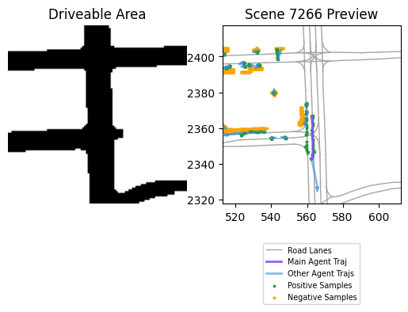
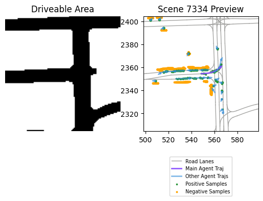
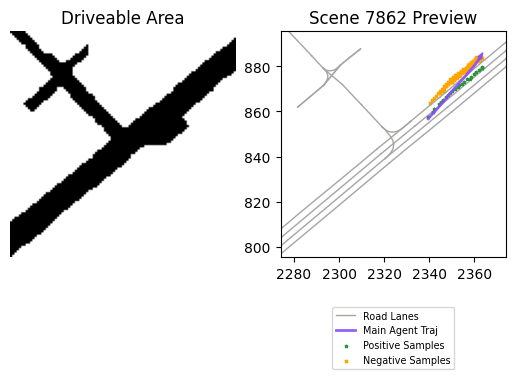
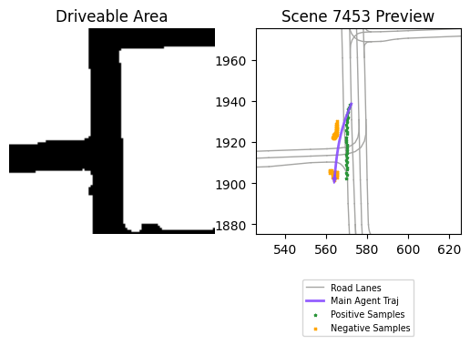
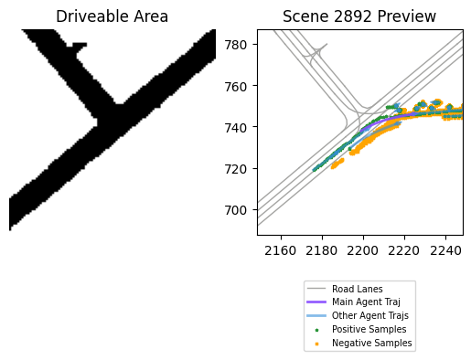
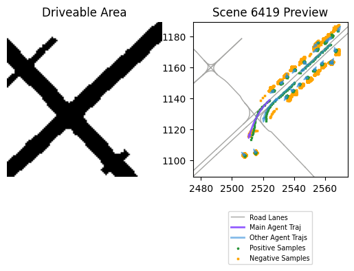
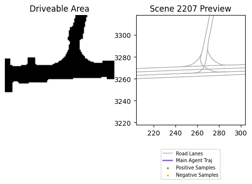
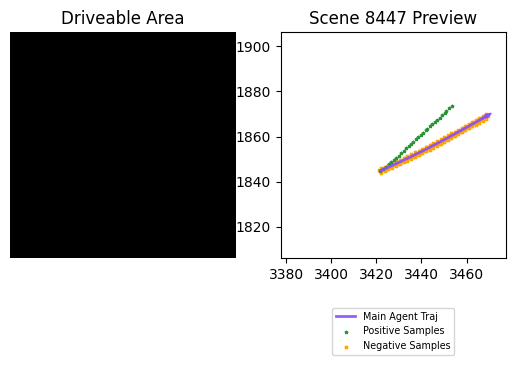

Semester project on contrastive learning to prevent offroad vehicle trajectories
---
Contacts (@epfl mail):
---
- Filip Slezak (author),
- Mohammadhossein Bahari (supervisor)

How to run:
---
[ScitasHelp](files/ScitasHelp.md) contains the scripts you might want to use to run the code on the clusters, request access to the sceneattack-env from the lab, installing the libraries and dataset yourself is really not practical

Settings
---
Four files might be of interest at first sight:
- [finetune.py](../../../finetune.py) for general experiment setup, typically its ID or for output file path
- [lanegcn.py](../lanegcn.py) for anything related to loss function (e.g. weights) or LaneGCN implementation
- [contrastive.py](contrastive.py) for SocialNCE loss parameters (changes to init only)
- [sampling.py](sampling.py) for sampling strategy details (choice to be set in contrastive.py)

All changes in the first two files are delimited or marked by tags `#!`, simply searching for those will indicate where to change the settings described below.

- [finetune.py](../../../finetune.py)
  - **experiment id** links your log to the experiments' spreadsheet details (see below)
- [lanegcn.py](../lanegcn.py)
  - **loss function weights**, with the current settings, the contrastive loss contribution lies between 20-30%
- [contrastive.py](contrastive.py)
  - config and sampler you may leave untouched
  - the horizon would require changes in other files, currently the data is divided as 20pts history 30pts future
  - **data_padding** defines how to pad missing data, necessary to have matching dimensions to feed the network
  - **pos/neg_horizon** number of positive/negative samples desired
  - **pos/neg_sampling** the sampling strategy used to generate positive/negative samples (detailed here after)
  - trajectory encoders might need to be changed if you change the input
  - **filter_trajs** if enabled, trajectories that lead nowhere (stationary) or that don't veer off road when the ground truth is on road are not considered
  - **visualizations** will generate the indicated number of figures (at least)
  - the criterion is fixed
  - **temperature** can be tuned, see SocialNCE paper for details of how it is used
- [sampling.py](sampling.py)
  - positive (points you want to get close to)
    - **truth** the ground truth measures
    - **noisy** a noisy version of the ground truth since it's ok to be a bit off
  - negative (points you want to avoid)
    - **offroad_expand** a discretized circle is scaled around each trajectory point until the desired number of off road samples is collected (scales indefinitely) - always the same relative orientation but it can be modulated
    - **offroad_cloud** a grid point cloud is generated and its off road points nearest to the trajectory are collected (defaults to zero if area size is insufficient) - a bit more uniform, fixed resolution of 1 meter

Experiments
---
There is an experiment [spreadsheet](../results/lanegcn/nce_tests/VITA%20Contrastive%20Learning%20Results.xlsxnce_tests/) available in the results folder documenting the attempts made throughout the semester.

The latest implementation yields the following results (not the best we got but quite close).
```
----------------------------------VALIDATION-------------------------------
Epoch: 8
On Real Data => ade: 1.463, fde: 3.239 off1: 0.198 off2: 1.30
On Synth Data => off1: 10.65 off2: 43.5
---------------------------------------------------------------------------
```
The original pretrained model is available at [here](../../../36.000.ckpt) and the checkpoint of our best result, experiment 27, stands [here](../results/lanegcn/27_1655058384_lr:0.0003-prop:[4011]-r:7-10000/8.000.ckpt).

The metrics used:
- **ADE** Average displacement error throughout trajectory, at each time step
- **FDE** Final displacement error
- **Off1** is Hard Off-road Rate (HOR): in order to measure the per- centage of samples with an inadmissible prediction with re- gards to the scene, we define HOR as the percentage of sce- narios that at least one off-road happens in the prediction trajectory points. It is rounded to the nearest integer.
- **Off2** is Soft Off-road Rate (SOR): to measure the performance in each scenario more thoroughly, we measure the percentage of off-road prediction points over all prediction points and the average over all scenarios is reported. The reported val- ues are rounded to the nearest integer.

Data:
- **Real** directly from the [Argoverse dataset](https://www.argoverse.org)
- **Synthetic** attacked scenes and trajectories, as described in the first paper referenced below

Report
---
The semester [project report](files/VITA_PDS.pdf) might be of interest to the ones taking this work in the same scope.

General
---
This semester project focused on the implementation of the framework, and constrained by time, no significant or relevant experimentation took place. Below are a few figures that lead us to believe that the implementation is correct and that we took the right path in development.

The first two show trajectories without filtering, the middle two show trajectories with valid filtering where short trajectories are discarded, the trajectory goes off road and the ground truth is valid, and the last two show non filtered trajectories that we avoid thanks to the filtering where the ground truth is off road (purely as an illustration of the need for the filtering - otherwise the loss functions would conflict, one minimising the final displacement, the other the contrast with our samples).








Observe that in the filtered visualizations, our negative samples lie exactly where we do not want our agent to go and the positive samples lie on the road. These trajectories will therefore be heavily penalized by the contrastive loss function, in addition to the displacement error.


Code marked with `#//` is related to data normalization. It ended up not being used and was commented to save time.

I tried to document what I reasonably could, however I dare not touch the parts I did not write myself, apologies for the inconvenience this may cause. Feel free to reach out regarding `contrastive.py` and `sampling.py`. However, I'd like to discourage the use of print statements for debugging since it takes a long time to run. Use the [python debugger](https://docs.python.org/3/library/pdb.html) instead.

Places to look for potential gains include the filtering strategy and parameter tuning. The rest seems correct and no ideas of how to improve it were brought up so far.

Known Issues
---
- The raster layer function may not be what we want (given its [doc](https://github.com/argoai/argoverse-api/blob/6e041da81000ca0bc9eb122f8d8e6429f7258db3/argoverse/map_representation/map_api.py#L426)) but it works remarkably well
- The visualizations are sometimes off (for an undiagnosed reason). These cases are rare and were not explored further.

I get about 20% invalid figures out of the filtered trajectories, where about 3-4 agents are selected per batches of about 400 trajectories. For the first image, simply increasing the scene radius should suffice to display our agents. For the second image, maybe it is incoherent data that made it through the filtering process. It is not impossible that there is a mistake in the re-indexing at the end of the preprocessing function but it has been checked several times and the other images are all fine so it would be quite a coincidence for them not to have an obvious mistake.





 For citation
---
```
@misc{https://doi.org/10.48550/arxiv.2112.03909,
  doi = {10.48550/ARXIV.2112.03909},
  url = {https://arxiv.org/abs/2112.03909},
  author = {Bahari, Mohammadhossein and Saadatnejad, Saeed and Rahimi, Ahmad and Shaverdikondori, Mohammad and Shahidzadeh, Amir-Hossein and Moosavi-Dezfooli, Seyed-Mohsen and Alahi, Alexandre},
  keywords = {Computer Vision and Pattern Recognition (cs.CV), FOS: Computer and information sciences, FOS: Computer and information sciences},
  title = {Vehicle trajectory prediction works, but not everywhere},
  publisher = {arXiv},
  year = {2021},
  copyright = {arXiv.org perpetual, non-exclusive license}
}

@misc{https://doi.org/10.48550/arxiv.2007.13732,
  doi = {10.48550/ARXIV.2007.13732},
  url = {https://arxiv.org/abs/2007.13732},
  author = {Liang, Ming and Yang, Bin and Hu, Rui and Chen, Yun and Liao, Renjie and Feng, Song and Urtasun, Raquel},
  keywords = {Computer Vision and Pattern Recognition (cs.CV), FOS: Computer and information sciences, FOS: Computer and information sciences},
  title = {Learning Lane Graph Representations for Motion Forecasting},
  publisher = {arXiv},
  year = {2020},
  copyright = {Creative Commons Attribution Non Commercial Share Alike 4.0 International}
}

@misc{https://doi.org/10.48550/arxiv.2012.11717,
  doi = {10.48550/ARXIV.2012.11717},
  url = {https://arxiv.org/abs/2012.11717},
  author = {Liu, Yuejiang and Yan, Qi and Alahi, Alexandre},
  keywords = {Machine Learning (cs.LG), Artificial Intelligence (cs.AI), Computer Vision and Pattern Recognition (cs.CV), Robotics (cs.RO), FOS: Computer and information sciences, FOS: Computer and information sciences},
  title = {Social NCE: Contrastive Learning of Socially-aware Motion Representations},
  publisher = {arXiv},
  year = {2020},
  copyright = {arXiv.org perpetual, non-exclusive license}
}
```
